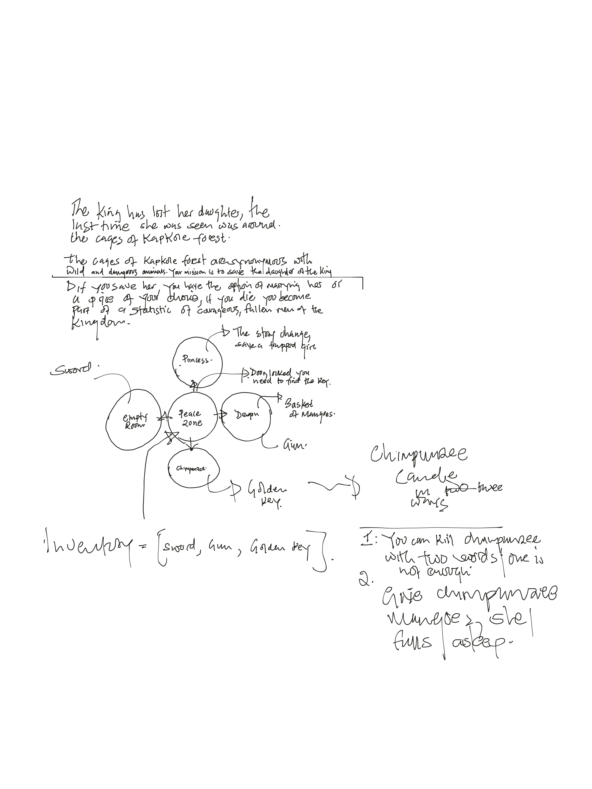
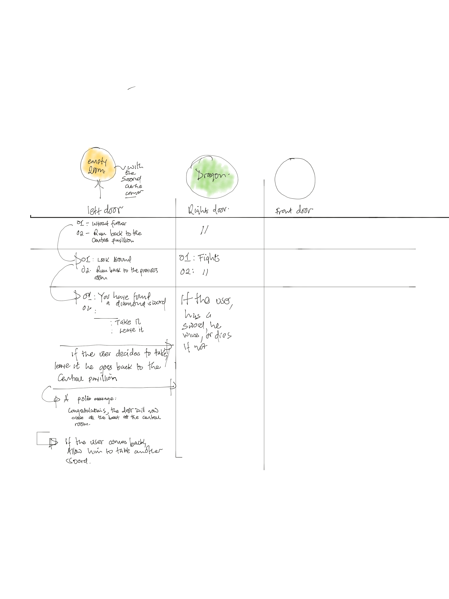

## Table of contents:
- [Introduction](#intro)
- [Technologies](#tech)
- [project Setup](#projo)
- [Illustrations](#illus)
- [Project Information](#info)
- [Contributing](#contri)
- [Acknowledgments](#know)

<INTRODUCTION>

<h1 id="intro">Introduction</h1>

## Command line game

The game is a classic text-based Dungeons and Dragons game.

### Highlights:
 - The are two doors, left and right
 - There is no way back, either you loose or die.

<TECHNOLOGIES>

<h1 id="tech">Technologies</h1>

## Builth With
- Python


<PROJECT-SETUP>

<h1 id="projo">Project Setup</h1>


## Hardware Requirements
- You will need a desktop or a laptop computer
- RAM: A minimum of 4GB RAM is recommended
- Disk Space: You should have at least 5GB free of space on your working hard drive

## Software Requirements

## Prerequisites

To get this project up and running locally, you must already have python plus the necessary packages installed on your computer

**simple steps to set up on your local machine**

```
- $ git clone `$ git clone https://github.com/symonkipkemei/command-line-game.git
- $ git checkout develop
- Run `python main.py`
```

- [Live Version](https://replit.com/@symonkipkemei/command-line-game#main.py)


<ILLUSTRATIONS>

<h1 id="illus">Illustrations of the game play</h1>






<PROJECT-INFORMATION>

<h1 id="info">Project Information</h1>

## Project Status
- Complete

## Features
- Make it playful

## TODO


<CONTRIBUTING>

<h1 id="contri">🤝 Contributing</h1>

Contributions, issues and feature requests are always welcome!

I love meeting other developers, interacting and sharing.

Feel free to check the [issues page](https://github.com/symonkipkemei/command-line-game/issues).

### How to Contribute

To get a local copy up and running follow these simple example steps.

```
- Fork the repository
- git clone https://github.com/your_username/command-line-game
- git checkout develop
- git checkout -b branch name
- git remote add upstream https://github.com/symonkipkemei/command-line-game
- git pull upstream develop
- git commit -m "commit message"
- git push -u origin HEAD
```


<ACKNOWLEDGMENTS>

<h1 id="know">Acknowledgements</h1>

## Author

👤 **Symon Kipkemei**

- Github: [symonkipkemei](https://github.com/symonkipkemei)
- Twitter: [@symon_kipkemei](https://twitter.com/symon_kipkemei)
- LinkedIn: [Symon kipkemei](https://www.linkedin.com/in/symon-kipkemei/)


## Show your support

Finally, if you've read this far, don't forget to give this repo a ⭐️. They're free . . . .

## Acknowledgments

- [codingnomads](https://codingnomads.co/).
